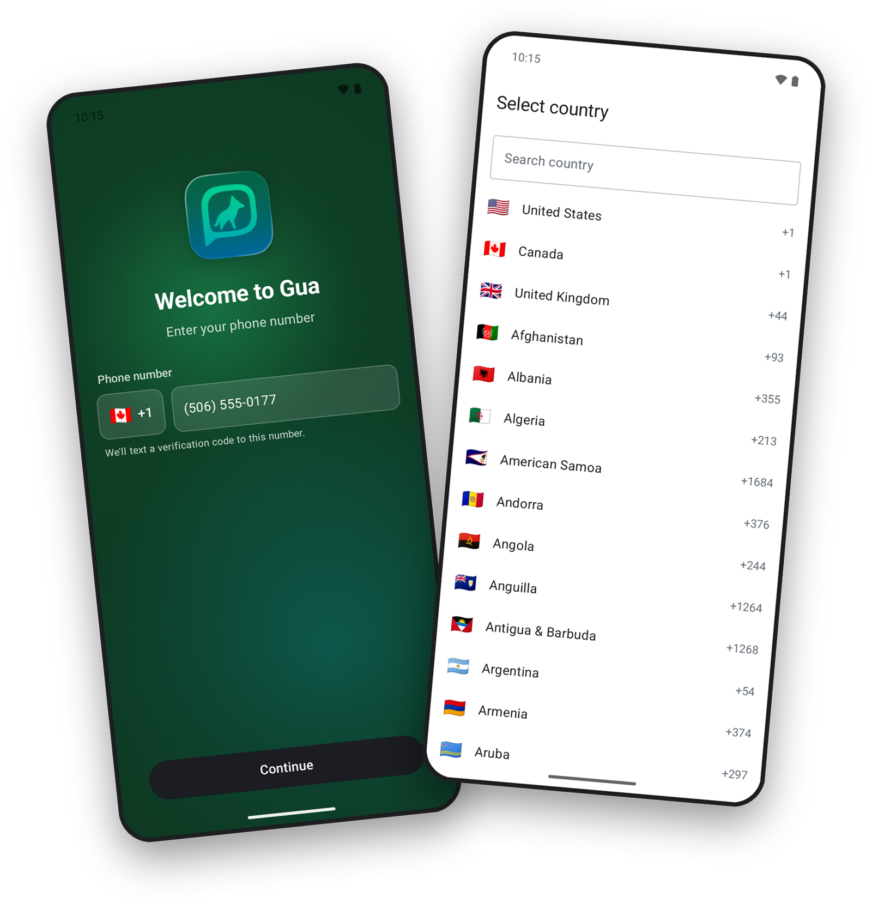
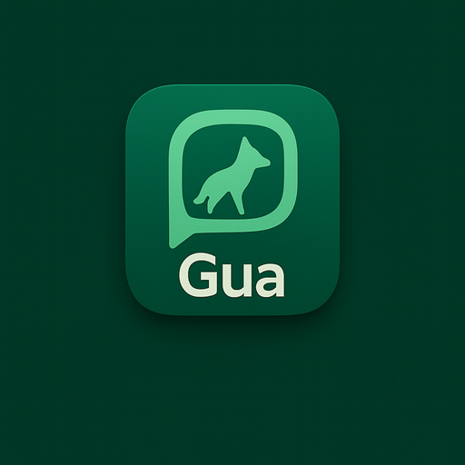

<div align="center">

  

  <h1>Gua for Android</h1>

</div>

## What this is

**Gua** is a private messenger. End-to-end encryption is on by default. It is built on [Matrix](https://matrix.org/).

This repository is Gua-ra's fork of [`element-hq/element-x-android`](https://github.com/element-hq/element-x-android) (Element X Android). Upstream provides the messaging core. This fork adds the Gua product layer on top: sign-in, routing, contact discovery, account management and the Gua look and feel.

---

## What the app does today

- **Finds your homeserver for you.** Gua runs as a closed federation of homeservers. At sign-in, the app asks [`gua-resolver`](https://github.com/Gua-ra/gua-resolver) which homeserver to use for your phone number. It then signs in through the Gua identity host and connects to that homeserver. You see usernames, never a server address.
- **Simple sign-in with a second step.** You enter your phone number and confirm a verification code. A 6-digit PIN protects the account as a second step. The flow is built to stay flexible: institutional SSO is planned for organizations that bring their own identity.
- **Private contact discovery.** Find Friends shows which of your contacts already use Gua and feeds straight into Start Chat. The app hashes phone numbers on the device and sends only the digests to the Gua identity service. It never sends the address book itself. Hashing makes the lookup more private. It does not make the numbers impossible to recover.
- **Phone number changes.** You can change the number linked to your account from Settings. The new number receives a one-time code. The account PIN is the second factor.
- **A Gua welcome screen.** The app opens on a native welcome screen with the Gua aurora, phone entry and a country picker.

### What is different from upstream Element X

| Area | Upstream (Element X) | Gua |
|---|---|---|
| Brand | Element / New Vector | Gua (`global.gua` application id) |
| Login flow | Matrix password / SSO with manual homeserver selection | Phone number and verification code, no homeserver picking. Institutional SSO planned |
| Welcome screen | Element onboarding | Gua aurora welcome with native phone entry and country picker |
| Account home | user selects a homeserver | resolved automatically behind the scenes (`libraries/guaresolver`) |
| Contact discovery | user directory search | Find Friends (hashed phone lookups) wired into Start Chat (`features/findfriends`) |
| Two-step verification | device verification | 6-digit account PIN: set, change, reset (`features/preferences` two-step verification) |
| Settings identity | full user id with server suffix | username only, server abstracted |
| Chat list | all rooms, including Spaces and empty rooms | chats-first: Spaces and state-only rooms are hidden |
| 1:1 conversations | state events visible in the timeline | configuration noise suppressed for clean 1:1 chats |
| Sign-in session handling | may silently resume a previous web session | fresh authentication forced on every sign-in (`prompt=login`) |
| Languages | upstream translations | adds Gua pt-BR and fr strings |

### How sign-in works today

```
Gua Android app
    |  1. resolver lookup by phone number: which homeserver to use
    v
gua-resolver
    |  2. OIDC authorization code + PKCE (Custom Tab) against the resolved server
    v
Matrix Authentication Service (Gua fork: gua-auth-service)
    |  3. delegated sign-in (phone + one-time code + PIN today; institutional SSO planned)
    v
Gua Identity Service
    |  provisioning, account PIN, contact lookup, phone-number changes
    v
Synapse homeserver in the Gua federation
```

- Before sign-in, the app asks [`gua-resolver`](https://github.com/Gua-ra/gua-resolver) which homeserver to use (`libraries/guaresolver`). The client never hardcodes a server. The federation layout stays out of the UI.
- The app registers as a public OIDC client and requires PKCE. It opens the sign-in flow in a Custom Tab. The [Gua fork of MAS](https://github.com/Gua-ra/gua-auth-service) and the [Gua Identity Service](https://github.com/Gua-ra/identity-service) serve that flow.
- Find Friends, the account PIN and phone number changes talk to the Gua Identity Service, not the resolver.
- End-to-end encryption stays on by default.

---

## How this relates to the target design

Everything above describes the current implementation. Parts of the target design are not shipped yet, including:

- **Per-homeserver authentication.** Today every sign-in completes at the single Gua identity host.
- **Verified routing.** Today the app follows the resolver's answer as given. It does not check that answer against signed federation state.

[Gua identity and federation](https://github.com/Gua-ra/gua-resolver/blob/main/docs/architecture/gua-identity-and-federation.md) explains the target in plain language. [ADM-001](https://github.com/Gua-ra/gua-resolver/blob/main/docs/decisions/ADM-001-identifier-binding-placement-trust.md) records the decision behind it.

---

## Building

### Requirements

You need **Android Studio** (or the Android command line tools) and **JDK 21**.

### Build a debug APK

```bash
git clone git@github.com:Gua-ra/gua-android.git
cd gua-android
./gradlew :app:assembleGplayDebug
```

Or open the project in Android Studio and run the `app` configuration. The debug application id is `global.gua.debug`.

### Point the app at your own Gua stack

Set the `gua.*` properties in `local.properties`:

```properties
gua.resolverBaseUrl=...
gua.identityServiceBaseUrl=...
gua.defaultAccountProvider=...
```

The upstream [contribution guide](CONTRIBUTING.md) covers environment setup, code generation and testing.

---

## Upstream relationship

This repository tracks [`element-hq/element-x-android`](https://github.com/element-hq/element-x-android). To pull upstream changes:

```bash
git fetch upstream
git merge upstream/develop   # or the relevant release tag
# Resolve conflicts, then push
```

The original Element X Android documentation follows below.

---

[](https://github.com/element-hq/element-x-android/actions/workflows/build.yml?query=branch%3Adevelop)
[](https://sonarcloud.io/summary/new_code?id=element-x-android)
[](https://sonarcloud.io/summary/new_code?id=element-x-android)
[](https://sonarcloud.io/summary/new_code?id=element-x-android)
[](https://codecov.io/github/element-hq/element-x-android)
[](https://matrix.to/#/#element-x-android:matrix.org)
[](https://localazy.com/p/element)

# Element X Android

Element X Android is the next-generation [Matrix](https://matrix.org/) client provided by [Element](https://element.io/).

Compared to the previous-generation [Element Classic](https://github.com/element-hq/element-android), the application is a total rewrite, using the [Matrix Rust SDK](https://github.com/matrix-org/matrix-rust-sdk) underneath and targeting devices running Android 7+. The UI layer is written using [Jetpack Compose](https://developer.android.com/jetpack/compose), and the navigation is managed using [Appyx](https://github.com/bumble-tech/appyx).

[](https://play.google.com/store/apps/details?id=io.element.android.x)[](https://f-droid.org/packages/io.element.android.x)

## Table of contents

<!--- TOC -->

* [Screenshots](#screenshots)
* [Translations](#translations)
* [Rust SDK](#rust-sdk)
* [Status](#status)
* [Minimum SDK version](#minimum-sdk-version)
* [Contributing](#contributing)
* [Build instructions](#build-instructions)
* [Support](#support)
* [Copyright and License](#copyright-and-license)

<!--- END -->

## Screenshots

Here are some screenshots of the application:

<!--
Commands run before taking the screenshots:
adb shell settings put system time_12_24 24
adb shell am broadcast -a com.android.systemui.demo -e command enter
adb shell am broadcast -a com.android.systemui.demo -e command clock -e hhmm 1337
adb shell am broadcast -a com.android.systemui.demo -e command network -e mobile show -e level 4
adb shell am broadcast -a com.android.systemui.demo -e command network -e wifi show -e level 4
adb shell am broadcast -a com.android.systemui.demo -e command notifications -e visible false
adb shell am broadcast -a com.android.systemui.demo -e command battery -e plugged false -e level 100

And to exit demo mode:
adb shell am broadcast -a com.android.systemui.demo -e command exit
-->

|||||
|-|-|-|-|
|||||

## Translations

Element X Android supports many languages. You can help us to translate the app in your language by joining our [Localazy project](https://localazy.com/p/element). You can also help us to improve the existing translations.

Note that for now, we keep control on the French and German translations.

Translations can be checked screen per screen using our tool Element X Android Gallery, available at https://element-hq.github.io/element-x-android/. Note that this page is updated every Tuesday.

More instructions about translating the application can be found at [CONTRIBUTING.md](CONTRIBUTING.md#strings).

## Rust SDK

Element X leverages the [Matrix Rust SDK](https://github.com/matrix-org/matrix-rust-sdk) through an FFI layer that the final client can directly import and use.

We're doing this as a way to share code between platforms and while we've seen promising results it's still in the experimental stage and bound to change.

## Status

This project is actively developed and supported. New users are recommended to use Element X instead of the previous-generation app.

## Minimum SDK version

Element X Android requires a minimum SDK version of 24 (Android 7.0, Nougat). We aim to support devices running Android 7.0 and above, which covers a wide range of devices still in use today.

Element Android Enterprise requires a minimum SDK version of 33 (Android 13, Tiramisu). For Element Enterprise, we support only devices that still receive security updates, which means devices running Android 13 and above. Android does not have a documented support policy, but some information can be found at [https://endoflife.date/android](https://endoflife.date/android).

## Contributing

Want to get actively involved in the project? You're more than welcome! A good way to start is to check the issues that are labelled with the [good first issue](https://github.com/element-hq/element-x-android/issues?q=is%3Aissue+is%3Aopen+label%3A%22good+first+issue%22) label. Let us know by commenting the issue that you're starting working on it.

But first make sure to read our [contribution guide](CONTRIBUTING.md) first.

You can also come chat with the community in the Matrix [room](https://matrix.to/#/#element-x-android:matrix.org) dedicated to the project.

## Build instructions

Just clone the project and open it in Android Studio. Make sure to select the
`app` configuration when building (as we also have sample apps in the project).

To build against a local copy of the Rust SDK, see the [Developer
onboarding](docs/_developer_onboarding.md#building-the-sdk-locally) instructions.

## Support

When you are experiencing an issue on Element X Android, please first search in [GitHub issues](https://github.com/element-hq/element-x-android/issues)
and then in [#element-x-android:matrix.org](https://matrix.to/#/#element-x-android:matrix.org).
If after your research you still have a question, ask at [#element-x-android:matrix.org](https://matrix.to/#/#element-x-android:matrix.org). Otherwise feel free to create a GitHub issue if you encounter a bug or a crash, by explaining clearly in detail what happened. You can also perform bug reporting from the application settings. This is especially recommended when you encounter a crash.

## Copyright and License

Copyright (c) 2025 Element Creations Ltd.
Copyright (c) 2022 - 2025 New Vector Ltd.

This software is dual licensed by Element Creations Ltd (Element). It can be used either:

(1) for free under the terms of the GNU Affero General Public License (as published by the Free Software Foundation, either version 3 of the License, or (at your option) any later version); OR

(2) under the terms of a paid-for Element Commercial License agreement between you and Element (the terms of which may vary depending on what you and Element have agreed to).

Unless required by applicable law or agreed to in writing, software distributed under the Licenses is distributed on an "AS IS" BASIS, WITHOUT WARRANTIES OR CONDITIONS OF ANY KIND, either express or implied. See the Licenses for the specific language governing permissions and limitations under the Licenses.
