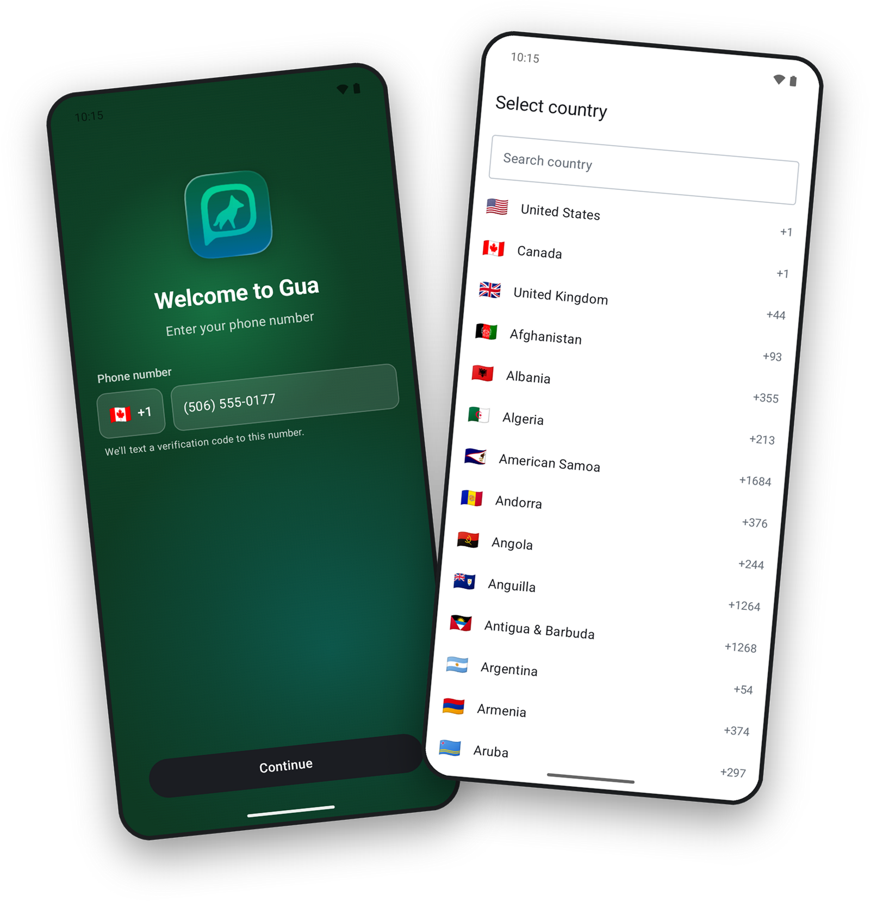
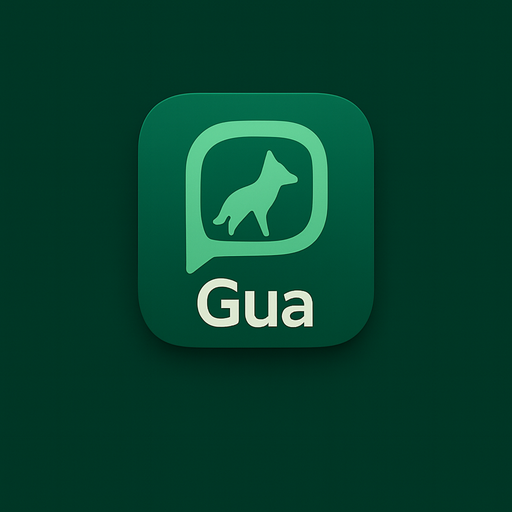

<div align="center">

  

  <h1>Gua for Android</h1>

</div>

## What this is

**Gua** is a private messenger. End-to-end encryption is on by default. It is built on [Matrix](https://matrix.org/).

This repository is Gua-ra's fork of [`element-hq/element-x-android`](https://github.com/element-hq/element-x-android) (Element X Android). Upstream provides the messaging core. This fork adds the Gua product layer on top: sign-in, routing, contact discovery, account management and the Gua look and feel.

## Get the app

Gua for Android is in an invite-only beta. Request access with the beta form at [gua.global/support](https://gua.global/support#beta-form). Approved testers receive an invitation by email with the install steps. The iOS app lives in [`gua-ios`](https://github.com/Gua-ra/gua-ios) and is distributed through TestFlight the same way.

---

## What the app does today

- **Finds your homeserver for you.** Gua runs as a closed federation of homeservers. At sign-in, the app asks [`gua-resolver`](https://github.com/Gua-ra/gua-resolver) which homeserver to use for your phone number. It then signs in through the Gua identity host and connects to that homeserver. You see usernames, never a server address.
- **Simple sign-in with a second step.** You enter your phone number and confirm a verification code. A 6-digit PIN protects the account as a second step. The flow is built to stay flexible: institutional SSO is planned for organizations that bring their own identity.
- **Private contact discovery.** Find Friends shows which of your contacts already use Gua and feeds straight into Start Chat. The app hashes phone numbers on the device and sends only the digests to the Gua identity service. It never sends the address book itself. Hashing makes the lookup more private. It does not make the numbers impossible to recover.
- **Phone number changes.** You can change the number linked to your account from Settings. The new number receives a one-time code. The account PIN is the second factor.
- **Account recovery warnings.** While someone is recovering the account through the delayed recovery, the chat list on every signed-in device says so and offers to cancel it.
- **A Gua welcome screen.** The app opens on a native welcome screen with the Gua aurora, phone entry and a country picker.

### What is different from upstream Element X

| Area | Upstream (Element X) | Gua |
|---|---|---|
| Brand | Element / New Vector | Gua (`global.gua` application id) |
| Login flow | Matrix password / SSO with manual homeserver selection | Phone number and verification code, no homeserver picking. Institutional SSO planned |
| Welcome screen | Element onboarding | Gua aurora welcome with native phone entry and country picker |
| Account home | user selects a homeserver | resolved automatically behind the scenes (`libraries/guaresolver`) |
| Contact discovery | user directory search | Find Friends (hashed phone lookups) wired into Start Chat (`features/findfriends`) |
| Two-step verification | device verification | 6-digit account PIN: set, change, reset (`features/preferences` two-step verification) |
| Settings identity | full user id with server suffix | username only, server abstracted |
| Chat list | all rooms, including Spaces and empty rooms | chats-first: Spaces and state-only rooms are hidden |
| 1:1 conversations | state events visible in the timeline | configuration noise suppressed for clean 1:1 chats |
| Sign-in session handling | may silently resume a previous web session | fresh authentication forced on every sign-in (`prompt=login`), in a private Custom Tab where the browser supports one |
| Languages | upstream translations | adds Gua pt-BR and fr strings |

### How sign-in works today

```
Gua Android app
    |  1. resolver lookup by phone number: which homeserver to use
    v
gua-resolver
    |  2. OIDC authorization code + PKCE (Custom Tab) against the resolved server
    v
Matrix Authentication Service (Gua fork: gua-auth-service)
    |  3. delegated sign-in (phone + one-time code + PIN today; institutional SSO planned)
    v
Gua Identity Service
    |  provisioning, account PIN, contact lookup, phone-number changes
    v
Synapse homeserver in the Gua federation
```

- Before sign-in, the app asks [`gua-resolver`](https://github.com/Gua-ra/gua-resolver) which homeserver to use (`libraries/guaresolver`). The client never hardcodes a server. The federation layout stays out of the UI.
- The app registers as a public OIDC client and requires PKCE. It opens the sign-in flow in a private (ephemeral) Custom Tab when the browser supports one, so no earlier browser session is carried into it. Account management stays in the shared tab and names the signed-in account (`org.matrix.msc4198.login_hint`). The [Gua fork of MAS](https://github.com/Gua-ra/gua-auth-service) and the [Gua Identity Service](https://github.com/Gua-ra/identity-service) serve that flow.
- Find Friends, the account PIN and phone number changes talk to the Gua Identity Service, not the resolver.
- End-to-end encryption stays on by default.

---

## How this relates to the target design

Everything above describes the current implementation. Parts of the target design are not shipped yet, including:

- **Per-homeserver authentication.** Today every sign-in completes at the single Gua identity host.
- **Verified routing.** Today the app follows the resolver's answer as given. It does not check that answer against signed federation state.

[Gua identity and federation](https://github.com/Gua-ra/gua-resolver/blob/main/docs/architecture/gua-identity-and-federation.md) explains the target in plain language. [ADM-001](https://github.com/Gua-ra/gua-resolver/blob/main/docs/decisions/ADM-001-identifier-binding-placement-trust.md) records the decision behind it.

---

## Building

### Requirements

You need **Android Studio** (or the Android command line tools) and **JDK 21**.

### Build a debug APK

```bash
git clone git@github.com:Gua-ra/gua-android.git
cd gua-android
./gradlew :app:assembleGplayDebug
```

Or open the project in Android Studio and run the `app` configuration. The debug application id is `global.gua.debug`.

### Point the app at your own Gua stack

Set the `gua.*` properties in `local.properties`:

```properties
gua.resolverBaseUrl=...
gua.identityServiceBaseUrl=...
gua.defaultAccountProvider=...
```

The [contribution guide](CONTRIBUTING.md) covers setup, quality checks and tests.

---

## Reporting problems

- Bugs and requests: [open an issue](https://github.com/Gua-ra/gua-android/issues).
- Security problems: follow [SECURITY.md](SECURITY.md). Never put them in a public issue.
- Anything else: the [support form](https://gua.global/support) or [support@gua.global](mailto:support@gua.global).

---

## Upstream relationship

This repository tracks [`element-hq/element-x-android`](https://github.com/element-hq/element-x-android). To pull upstream changes:

```bash
git fetch upstream
git merge upstream/develop   # or the relevant release tag
# Resolve conflicts, then push
```

Element X Android is the Matrix client made by [Element](https://element.io/). It uses the [Matrix Rust SDK](https://github.com/matrix-org/matrix-rust-sdk) through an FFI layer, [Jetpack Compose](https://developer.android.com/jetpack/compose) for the UI and [Appyx](https://github.com/bumble-tech/appyx) for navigation, and requires Android 7.0 (API 24) or newer. Gua inherits all of that. Element X's own store listings, translation project, community rooms and support channels are Element's and do not cover Gua.

## Copyright and License

Copyright (c) 2025 Element Creations Ltd.
Copyright (c) 2022 - 2025 New Vector Ltd.
Copyright (c) 2026 Gua (Gua modifications)

This software is dual licensed by Element Creations Ltd (Element). It can be used either:

(1) for free under the terms of the GNU Affero General Public License (as published by the Free Software Foundation, either version 3 of the License, or (at your option) any later version); OR

(2) under the terms of a paid-for Element Commercial License agreement between you and Element (the terms of which may vary depending on what you and Element have agreed to).

Gua's modifications are available under the same AGPL terms. See [LICENSE](LICENSE) and [LICENSE-COMMERCIAL](LICENSE-COMMERCIAL).

Unless required by applicable law or agreed to in writing, software distributed under the Licenses is distributed on an "AS IS" BASIS, WITHOUT WARRANTIES OR CONDITIONS OF ANY KIND, either express or implied. See the Licenses for the specific language governing permissions and limitations under the Licenses.
